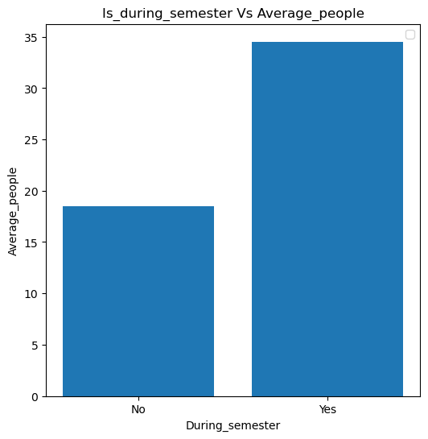

### Introduction:
+ Dataset contains over 60,000 observations about how many people were at the gym on a particular day and time

### Goal:

+ To predict the number of people at the gym based on the provided data.
+ To evaluate whether the model is accurate enough to determine the best times to visit the gym.
+ To identify the optimal days and times for going to the gym based on attendance patterns

### Dataset contains:
 + `number_people`: this is the number of people at the gym at each observation. This will be our target variable or label.
 + `date`: a string value with the specific date and time information.
 + `timestamp`: an integer (int), with the number of seconds since the start of the day (00:00).
 + `dayofweek`: an integer (int). 0 is equal to Monday and 6 is equal to Sunday.
 + `is_weekend`: a Boolean value defining if this observation happened during a weekend. 1 for yes, 0 for no.
 + `is_holiday`: a Boolean value defining if the observation happened during a holiday. 1 for yes, 0 for no.
 + `temperature`: a float, defining the temperature during the day of the observation in Fahrenheit.
 + `is_startof_semester`: a Boolean defining if the observation happened in the first 2 weeks of a semester. 1 for yes, 0 for no.
 + `is_during_semester`: a Boolean defining if the observation happened during the active semester. 1 for yes, 0 for no.
 + `month`: an integer (int) defining the month of the year. 1 is equal to January, 12 is equal to December.
 + `hour`: an integer (int) for the hour of the day from 0 to 23.


```python
# Importing libraries 
import numpy as np
import pandas as pd
import matplotlib.pyplot as plt
%matplotlib inline
```


```python
# Reading the CSV data into pandas dataframe
data = pd.read_csv('crowdness_gym_data.csv')

# Sample data
print(data.head(2))
```

       number_people                       date  timestamp  day_of_week  \
    0             37  2015-08-14 17:00:11-07:00      61211            4   
    1             45  2015-08-14 17:20:14-07:00      62414            4   
    
       is_weekend  is_holiday  temperature  is_start_of_semester  \
    0           0           0        71.76                     0   
    1           0           0        71.76                     0   
    
       is_during_semester  month  hour  
    0                   0      8    17  
    1                   0      8    17  


```python
# Shape of the data
print('Number of rows and columns in the data:',data.shape)
```

    Number of rows and columns in the data: (62184, 11)


### EDA Analysis:
+ The dataset has no missing (null) values in any of its columns/fields.

+ The provided date is in the Pacific Time Zone, which includes both Pacific Daylight Time (PDT), 7 hours behind UTC (represented by -07:00), and Pacific Standard Time (PST), 8 hours behind UTC (represented by -08:00). I converted the time to Central Standard Time (CST) for analysis.

+ Data was collected over the years 2015, 2016, and 2017, with 73% of the data coming from 2016, 22% from 2015, and 5% from 2017.

+ 71% of the data represents weekdays, while 29% represents weekends.

+ The average number of people in the gym decreased gradually from 43 people in 2015 to 20 people in 2017.The highest attendance is observed in the months of September, October, and November.

+ Early mornings appear less crowded compared to the evenings

+ Temperature appears to influence gym attendance. Higher temperatures are associated with more people in the gym.

+ On average, the number of people in the gym stays around 32 on Sundays, Mondays, and Tuesdays. As the week progresses toward the weekend, there is a noticeable decline in average attendance.

+ The peak gym attendance occurs at 18:00, with an average of 48 people. This is the highest mean attendance across all hours, suggesting that people tend to work out after work.

+ On average, there are about 43 people in the gym at the start of the semester, compared to 34 people during the semester. The attendance at the beginning of the semester is higher than during the semester.


```python
# Data columns data types
print(data.info())
```

    <class 'pandas.core.frame.DataFrame'>
    RangeIndex: 62184 entries, 0 to 62183
    Data columns (total 11 columns):
     #   Column                Non-Null Count  Dtype  
    ---  ------                --------------  -----  
     0   number_people         62184 non-null  int64  
     1   date                  62184 non-null  object 
     2   timestamp             62184 non-null  int64  
     3   day_of_week           62184 non-null  int64  
     4   is_weekend            62184 non-null  int64  
     5   is_holiday            62184 non-null  int64  
     6   temperature           62184 non-null  float64
     7   is_start_of_semester  62184 non-null  int64  
     8   is_during_semester    62184 non-null  int64  
     9   month                 62184 non-null  int64  
     10  hour                  62184 non-null  int64  
    dtypes: float64(1), int64(9), object(1)
    memory usage: 5.2+ MB
    None


```python
# Convert the 'date' column to datetime 
# Convert pacific time zone to UTC time zone
data['date']= pd.to_datetime(data['date'], utc = True)
```


```python
# Convert the 'date' column to CST timezone from UTC
data['date'] = data['date'].dt.tz_convert('America/Chicago')
```


```python
# Data columns data types
print(data.info())
```

    <class 'pandas.core.frame.DataFrame'>
    RangeIndex: 62184 entries, 0 to 62183
    Data columns (total 11 columns):
     #   Column                Non-Null Count  Dtype                          
    ---  ------                --------------  -----                          
     0   number_people         62184 non-null  int64                          
     1   date                  62184 non-null  datetime64[ns, America/Chicago]
     2   timestamp             62184 non-null  int64                          
     3   day_of_week           62184 non-null  int64                          
     4   is_weekend            62184 non-null  int64                          
     5   is_holiday            62184 non-null  int64                          
     6   temperature           62184 non-null  float64                        
     7   is_start_of_semester  62184 non-null  int64                          
     8   is_during_semester    62184 non-null  int64                          
     9   month                 62184 non-null  int64                          
     10  hour                  62184 non-null  int64                          
    dtypes: datetime64[ns, America/Chicago](1), float64(1), int64(9)
    memory usage: 5.2 MB
    None


```python
# Checking for Null Values in Columns
print(data.isnull().sum())
```

    number_people           0
    date                    0
    timestamp               0
    day_of_week             0
    is_weekend              0
    is_holiday              0
    temperature             0
    is_start_of_semester    0
    is_during_semester      0
    month                   0
    hour                    0
    dtype: int64


```python
# Percentage of weekends vs working days
# 71% of the data represents weekdays, while 29% represents weekends
print(data['is_weekend'].value_counts(normalize = True))
```

    is_weekend
    0    0.71713
    1    0.28287
    Name: proportion, dtype: float64


```python
# Extracting the year from the date and assigning it to the seperate column
# Percentage of data for each year
data['year'] = data['date'].dt.year
print(data['year'].value_counts(normalize = True)*100)
```

    year
    2016    73.240705
    2015    21.804644
    2017     4.954651
    Name: proportion, dtype: float64


```python
# Extracting the date from a datetime column and assigning it to a separate column
data['dt_date'] = pd.to_datetime(data['date'].dt.date)
print(data['dt_date'].head(2))
```

    0   2015-08-14
    1   2015-08-14
    Name: dt_date, dtype: datetime64[ns]


```python
# Average people per day
Mean_count = data.groupby(['dt_date']).agg(average_people=('number_people','mean')).reset_index()

# Displays the first 5 rows
print(Mean_count.head())
```

         dt_date  average_people
    0 2015-08-14       42.960000
    1 2015-08-15       22.540000
    2 2015-08-16       19.770000
    3 2015-08-17       34.840000
    4 2015-08-18       34.128713


```python
# Plot of the average number of people in the gym per day over a three-year period
plt.figure(figsize=(8,6))
plt.plot(Mean_count['dt_date'], Mean_count['average_people'])
plt.xticks(rotation = 90)
plt.ylabel('Average_people') 
plt.xlabel('Date') 
plt.title('Average number of people per day over a three-year period in the Gym')
plt.legend()
plt.grid(True)
plt.show()
```

    /var/folders/16/3tzmlcc129z3xr007ykwjb640000gp/T/ipykernel_1551/3054329351.py:8: UserWarning: No artists with labels found to put in legend.  Note that artists whose label start with an underscore are ignored when legend() is called with no argument.
      plt.legend()


    

    


```python
# Average people per month per year
Mean_count_year_per_month = data.groupby(['year','month']).agg(average_people=('number_people','mean')).reset_index()
print(Mean_count_year_per_month)
```

        year  month  average_people
    0   2015      8       38.570696
    1   2015      9       55.552706
    2   2015     10       49.938015
    3   2015     11       42.120660
    4   2015     12       29.798807
    5   2016      1       40.347094
    6   2016      2       43.222028
    7   2016      3       36.844186
    8   2016      4       38.538406
    9   2016      5       19.837116
    10  2016      6       20.309137
    11  2016      7       20.730380
    12  2016      8       21.958939
    13  2016      9       27.108653
    14  2016     10       22.165446
    15  2016     11       19.587717
    16  2016     12       12.266697
    17  2017      1       12.973477
    18  2017      2       23.470426
    19  2017      3       25.069539
    20  2017     12        0.076923


```python
# Plot of Average people vs Month
# The highest attendance is observed in the months of September, October, and November

plt.figure(figsize=(6,6))
plt.bar(Mean_count_year_per_month['month'], Mean_count_year_per_month['average_people'],label = 'Average_people in the gym')
plt.xticks(rotation = 90)
plt.ylabel('Average_people') 
plt.xlabel('Month') 
plt.title('Month Vs Average_people')
plt.legend()
plt.show()
```


    

    


```python
# Average people vs temperature
Mean_temp_count = data.groupby(['temperature']).agg(average_people=('number_people','mean')).reset_index()
print(Mean_temp_count.head(2))
```

       temperature  average_people
    0        38.14             0.0
    1        38.92             0.0


```python
# Plot of Average people vs temperature
plt.figure(figsize=(6,6))
plt.scatter(Mean_temp_count['temperature'], Mean_temp_count['average_people'],label = 'Average_people in the gym')
plt.xticks(rotation = 90)
plt.ylabel('Average_people') 
plt.xlabel('Temperature') 
plt.title('Temperature Vs Average_people')
plt.legend()
plt.grid(True)
plt.show()
```


    

    


```python
# Average people vs Holiday
Mean_Holi_count = data.groupby('is_holiday').agg(average_people=('number_people','mean')).reset_index()
print(Mean_Holi_count.head)
```

    <bound method NDFrame.head of    is_holiday  average_people
    0           0       29.128144
    1           1        7.518750>


```python
# Plot of Average people vs Holiday
plt.figure(figsize=(6,6))
plt.bar(Mean_Holi_count['is_holiday'], Mean_Holi_count['average_people'],width=0.4)
plt.ylabel('Average_people') 
plt.xlabel('Holiday') 
plt.xticks([0, 1], ['No', 'Yes'])
plt.title('Holiday Vs Average_people')
plt.legend()
plt.show()
```

    /var/folders/16/3tzmlcc129z3xr007ykwjb640000gp/T/ipykernel_1551/677471209.py:8: UserWarning: No artists with labels found to put in legend.  Note that artists whose label start with an underscore are ignored when legend() is called with no argument.
      plt.legend()


    

    


```python
# Average people vs day of the week
# Motivation to work out is higher on the early days of the week compared to the later days

Mean_DOW_count = data.groupby(['day_of_week']).agg(average_people=('number_people','mean')).reset_index()
print(Mean_DOW_count)
```

       day_of_week  average_people
    0            0       32.653315
    1            1       32.435926
    2            2       32.441376
    3            3       30.217455
    4            4       29.957105
    5            5       22.956699
    6            6       22.618613


```python
# Plot of Average people vs Holiday
plt.figure(figsize=(6,6))
plt.bar(Mean_DOW_count['day_of_week'], Mean_DOW_count['average_people'])
plt.ylabel('Average_people') 
plt.xlabel('Day_of_week') 
plt.title('Day_of_week Vs Average_people')
plt.legend()
plt.show()
```

    /var/folders/16/3tzmlcc129z3xr007ykwjb640000gp/T/ipykernel_1551/1453416496.py:7: UserWarning: No artists with labels found to put in legend.  Note that artists whose label start with an underscore are ignored when legend() is called with no argument.
      plt.legend()


    

    


```python
# Average people vs timestamp
Mean_timestamp_count = data.groupby(['hour']).agg(average_people=('number_people','mean')).reset_index()
print(Mean_timestamp_count.head(2))
```

       hour  average_people
    0     0       14.720282
    1     1        2.404040


```python
# Plot of Average people vs Holiday
# Early mornings are less crowded in the gym compared to the evenings

plt.figure(figsize=(6,6))
plt.bar(Mean_timestamp_count['hour'], Mean_timestamp_count['average_people'])
plt.ylabel('Average_people') 
plt.xlabel('Hour') 
plt.title('Hour Vs Average_people')
plt.xticks(ticks=data['hour'])
plt.xticks(rotation = 90)
plt.legend()
plt.show()
```

    /var/folders/16/3tzmlcc129z3xr007ykwjb640000gp/T/ipykernel_1551/3941646324.py:11: UserWarning: No artists with labels found to put in legend.  Note that artists whose label start with an underscore are ignored when legend() is called with no argument.
      plt.legend()


    

    


```python
# Average people vs start of the semester
Mean_st_sem_count = data.groupby('is_start_of_semester').agg(average_people=('number_people','mean')).reset_index()
print(Mean_st_sem_count.head)
```

    <bound method NDFrame.head of    is_start_of_semester  average_people
    0                     0       27.860026
    1                     1       43.241330>


```python
# Plot of Average people vs Start_of_semester
plt.figure(figsize=(6,6))
plt.bar(Mean_st_sem_count['is_start_of_semester'], Mean_st_sem_count['average_people'],width = 0.4)
plt.ylabel('Average_people') 
plt.xlabel('start_of_semester') 
plt.xticks([0, 1], ['No', 'Yes'])
plt.title('start_of_semester Vs Average_people')
plt.legend()
plt.show()
```

    /var/folders/16/3tzmlcc129z3xr007ykwjb640000gp/T/ipykernel_1551/867512241.py:8: UserWarning: No artists with labels found to put in legend.  Note that artists whose label start with an underscore are ignored when legend() is called with no argument.
      plt.legend()


    

    


```python
# Average people vs During  semester
Mean_D_sem_count = data.groupby('is_during_semester').agg(average_people=('number_people','mean')).reset_index()
print(Mean_D_sem_count.head)
```

    <bound method NDFrame.head of    is_during_semester  average_people
    0                   0       18.466468
    1                   1       34.530971>


```python
# Plot of Average people vs Is_during_semester
plt.figure(figsize=(6,6))
plt.bar(Mean_D_sem_count['is_during_semester'],Mean_D_sem_count['average_people'])
plt.ylabel('Average_people') 
plt.xlabel('During_semester') 
plt.xticks([0, 1], ['No', 'Yes'])
plt.title('Is_during_semester Vs Average_people')
plt.legend()
plt.show()
```

    /var/folders/16/3tzmlcc129z3xr007ykwjb640000gp/T/ipykernel_7365/2908978.py:8: UserWarning: No artists with labels found to put in legend.  Note that artists whose label start with an underscore are ignored when legend() is called with no argument.
      plt.legend()


    

    


### Correlation Analysis:
+ Timestamp(particularly hour), Temperature, Start and During semester features has a positive correlation with the outcome 'number_people' 


```python
correlation_data = data[data.select_dtypes(include=['int64','float64']).columns.values].corr()
print(correlation_data['number_people'])
```

    number_people           1.000000
    timestamp               0.550218
    day_of_week            -0.162062
    is_weekend             -0.173958
    is_holiday             -0.048249
    temperature             0.373327
    is_start_of_semester    0.182683
    is_during_semester      0.335350
    month                  -0.097854
    hour                    0.552049
    Name: number_people, dtype: float64


```python
import seaborn as sns
import matplotlib.pyplot as plt
plt.figure(figsize=(6,6))
sns.heatmap(correlation_data, cmap="Blues",fmt=".2f",cbar=True,annot=True)
plt.show()
```


    

    


```python
# importing Library necessary for building the model
import numpy as np
from sklearn.model_selection import train_test_split
from sklearn.linear_model import SGDRegressor
from sklearn.metrics import mean_squared_error
from sklearn.preprocessing import StandardScaler
```

### SGD Model


```python
X = data.drop(columns = ['number_people','timestamp','date','dt_date'])
y = data['number_people']
```


```python
print(X.columns)
```

    Index(['day_of_week', 'is_weekend', 'is_holiday', 'temperature',
           'is_start_of_semester', 'is_during_semester', 'month', 'hour', 'year'],
          dtype='object')


```python
X_train, X_test, y_train, y_test = train_test_split(X,y,test_size=0.30,random_state = 412)

scaler = StandardScaler().fit(X_train)

X_train = scaler.transform(X_train)
X_test = scaler.transform(X_test)
```


```python
sgdr = SGDRegressor(tol=1e-4, eta0=1e-4, max_iter=10000)
sgdr.fit(X_train, y_train)
predictions_ytrain = sgdr.predict(X_train)
predictions_ytest = sgdr.predict(X_test)
```

### Performance Measurement 

+ With a Root Mean Squared Error (RMSE) value of 14.42, my model's predictions are, on average, off by 14 units from the true values. The lower the RMSE value, the closer the predictions are to the actual values.

+ With an R² score of 0.601, the training set features explain 60.1% of the variance in the training set data. Meanwhile with an R² score of 0.5968, the test set features explain 59.68% of the variance in the test set data


```python
MES = mean_squared_error(y_test, predictions_ytest)
rmse = mean_squared_error(y_test, predictions_ytest, squared=False)
print('MES:',MES,'RMSE:',rmse)
```

    MES: 208.0475437112027 RMSE: 14.423853289298346


    /Users/nandhinimuthalraj/Documents/anaconda/anaconda3/lib/python3.12/site-packages/sklearn/metrics/_regression.py:492: FutureWarning: 'squared' is deprecated in version 1.4 and will be removed in 1.6. To calculate the root mean squared error, use the function'root_mean_squared_error'.
      warnings.warn(


```python
residuals_train =  y_train - predictions_ytrain  # Actual and predicted difference of values
residuals_test =  y_test - predictions_ytest 
print(residuals_train.head(2))
print(residuals_test.head(2))
```

    49923   -15.307838
    18614     5.181126
    Name: number_people, dtype: float64
    19389   -9.702350
    26391    4.433606
    Name: number_people, dtype: float64


```python
# Mean residuals expected to be close to zero
residual_train_mean = residuals_train.mean()
residual_test_mean = residuals_test.mean()

print('Residual Training set mean:',residual_train_mean)
print('Residual Test Set mean:',residual_test_mean)
```

    Residual Training set mean: 0.00018676842427974626
    Residual Test Set mean: -0.06117994303661491


```python
from sklearn.metrics import r2_score
R2_score_train = r2_score(y_train,predictions_ytrain)
R2_score_test = r2_score(y_test,predictions_ytest)

print('R2 Score training data:',R2_score_train)
print('R2 Score test data:',R2_score_test)
```

    R2 Score training data: 0.601065574253571
    R2 Score test data: 0.5968155374048006


```python
# Plot Training set
plt.figure(figsize=(6,6))
plt.scatter(y_train.index,y_train,label="original",alpha=0.7)
plt.scatter(y_train.index,predictions_ytrain,label="predictions",alpha=0.7)
plt.legend()
plt.title('Training set True vs Predicted Values')
plt.grid(True)
plt.show()
```


    

    


```python
# Scatter plot Test set
plt.figure(figsize=(6,6))
plt.scatter(y_test.index,y_test,label="original",alpha=0.7,color = 'grey')
plt.scatter(y_test.index,predictions_ytest,label="predictions",alpha=0.7,color ='orange')
plt.legend()
plt.title('Test set True vs Predicted Values')
plt.grid(True)
plt.show()
```


    

    


### Residuals Plot - Training data

+ Residuals are around the zero which is the difference between the Actual and predicted values


```python
# Plot residuals
plt.figure(figsize=(6,6))
plt.scatter(y_train.index, residuals_train, alpha=0.5)  # Scatter plot for residuals

# Add a horizontal line at y=0 to visualize no error
plt.axhline(0, color='black', linewidth=1)

# Customize plot
plt.xlabel('Index')  # or 'Data points', depending on what you're plotting
plt.ylabel('Residuals')
plt.title('Residuals Plot - Training set')
plt.grid(True)
plt.show()
```


    

    


### Residuals - Test data

+ Residuals are around the zero which is the difference between the Actual and predicted values


```python
# Plot residuals
plt.figure(figsize=(6,6))
plt.scatter(y_test.index, residuals_test, alpha=0.5)  # Scatter plot for residuals

# Add a horizontal line at y=0 to visualize no error
plt.axhline(0, color='black', linewidth=1)

# Customize plot
plt.xlabel('Index')  # or 'Data points', depending on what you're plotting
plt.ylabel('Residuals')
plt.title('Residuals Plot - Test set')
plt.grid(True)
plt.show()
```


    

    


### Results:

+ Based on the performance metrics, the SGD model with the SGD Regressor is well-suited for predicting the continuous variable in the provided data.

+ The model has been improved by removing redundant features, such as the date column, which included date, time, and timezone, as well as the timestamp column.

+ The default parameters outperform the model when compared to those optimized through fine-tuning

### Recommendations:

+ The best days to visit the gym with fewer crowds are typically Thursday and Friday, as attendance tends to drop towards the weekend. These days are ideal if you prefer to avoid peak crowds, while Sundays, Mondays, and Tuesdays generally experience higher attendance.

+ Early mornings are usually quieter compared to the evenings, making mornings the optimal time for a less crowded gym experience. However, if you don’t mind a busier environment, the gym tends to be most crowded around 18:00, which is the peak time.

+ Weekends generally see lower attendance, so Saturday and Sunday afternoons are great options if you’re looking for a quieter gym experience.


```python

```
